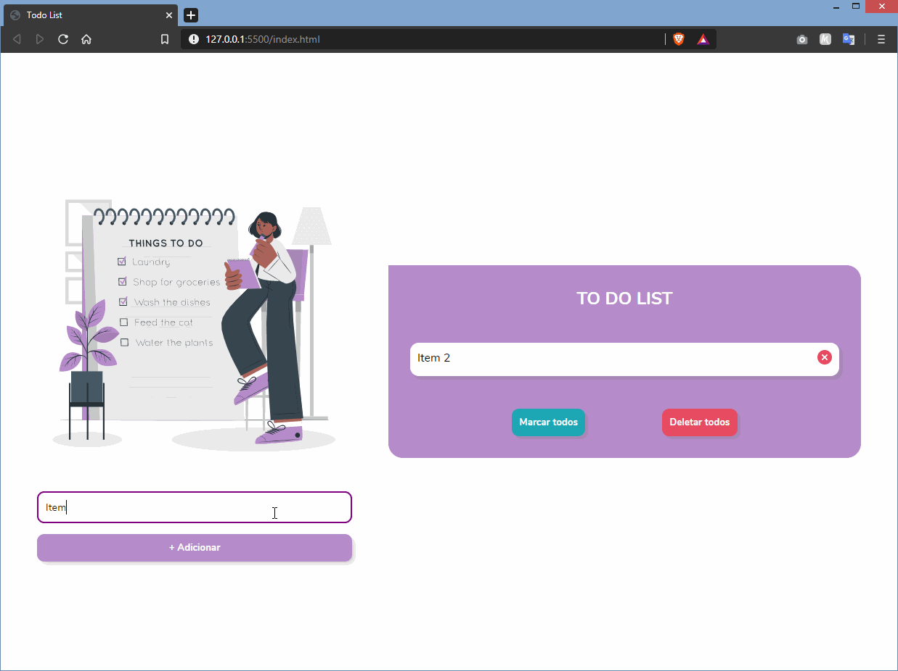

# :bookmark_tabs: To Do List
> Projeto realizado como exercício para a aula de javascript da Reprograma.

### :memo: Funcionalidades: 
- poder adicionar e remover tarefas
- poder marcar tarefas como feitas
- ao adicionar tarefa, o campo de input deve ser limpo.
- não pode adicionar tarefa vazia
- botão para marcar todas as tarefas
- botão para deletar todas as tarefas
- opção de arrastar e soltar os itens

### :film_strip: Demonstração 

### :computer_mouse: Tecnologias Utilizadas:
* HTML5
* CSS3
* Javascript

### :woman_technologist: Autora:
[Izáira Cunha](https://www.linkedin.com/in/izairacs/)
